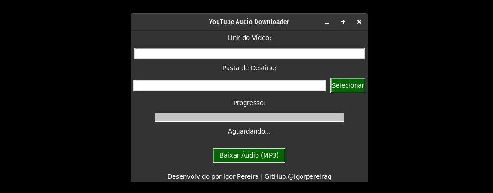

# YouTube Audio Downloader

EstA é um aplicacão  para baixar áudio de vídeos do YouTube em formato MP3. O aplicativo foi desenvolvido em Python utilizando a biblioteca Tkinter para a interface gráfica e o yt-dlp para o download de áudio.



## Funcionalidades

- Baixar áudio de vídeos do YouTube em formato MP3
- Escolher a pasta de destino para o download
- Acompanhar o progresso do download na barra de progresso
- Interface amigável e simples de usar

## Como usar

1. Abra o terminal/prompt de comando na pasta onde você salvou o projeto.
2. Execute o seguinte comando para iniciar o aplicativo:

```bash
python main.py
```

3. O aplicativo será aberto e você poderá inserir o link do vídeo do YouTube que deseja baixar.
4. Escolha a qualidade desejada (o aplicativo baixa a melhor qualidade disponível automaticamente).
5. Selecione a pasta de destino para o download.
6. Clique no botão "Baixar Áudio (MP3)" para iniciar o download.
7. Acompanhe o progresso na barra de progresso e aguarde até que o áudio seja baixado.
8. Após o download completo, o arquivo MP3 estará disponível na pasta de destino selecionada.

## Contribuições

Contribuições são bem-vindas! Se você tiver sugestões, correções de bugs ou melhorias para este projeto, sinta-se à vontade para abrir uma issue ou enviar um pull request.

